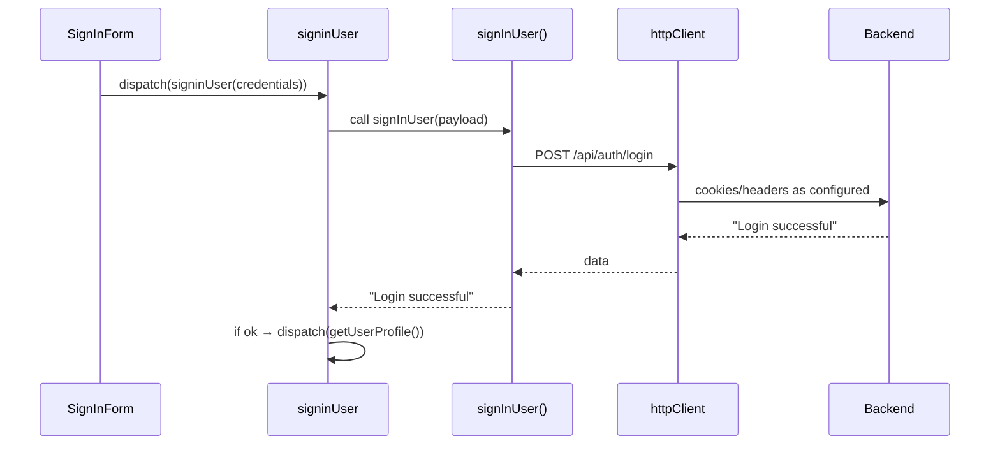

**File:** `src/api/services/auth/auth-api.ts`  
**Depends on:** `src/api/http-client.ts`  
**Used by:** `auth` slice thunks (`signupUser`, `signinUser`, `googleSignInUser`, `verifyEmail`, `logoutUser`, `getUserProfile` (separate user service), etc.)

## Functions

### `getNewAPI() → any`
Diagnostics/example call to `/testEndpoint`.

```ts
const res = await httpClient.get('/testEndpoint');
return res.data;
```

### `registerUser(userData: RegisterRequest) → Promise<string>`

Registers a new user.

- **Method/URL**: `POST api/auth/register`
- **Body**: `RegisterRequest`
- **Creds**: `withCredentials: false` (overrides per call)
- **Returns**: success message (`string`)

```ts
const res = await httpClient.post<string>('api/auth/register', userData, {
  withCredentials: false,
});
return res.data;
```

### `verifyEmailApi(token: string) → Promise<AxiosResponse<any>>`


Verifies email using a token.

- **Method/URL**: `GET api/auth/verify?token=<token>`
- **Creds**: `withCredentials: false` (overrides per call)
- **Returns**: full Axios response (callers typically want `response.data`)

```ts
httpClient.get('api/auth/verify?token=' + token, { withCredentials: false });
```

> Consider returning `response.data` for consistency with other functions.

### `signInUser(userData: LoginRequest) → Promise<string>`

Email/password login.

- **Method/URL**: `POST api/auth/login`
- **Body**: `LoginRequest`
- **Returns**: success message (`string`, e.g., `"Login successful"`).

Your thunk uses this string to decide whether to dispatch `getUserProfile()`.

### `logoutAPI() → Promise<null>`

Logs out (server clears session/cookies).

- **Method/URL**: `POST api/auth/logout`
- **Returns**: `null`

### `googleAPI(idToken: GoogleLoginRequest) → Promise<string>`

Google one-tap / OAuth sign-in.

- **Method/URL**: `POST api/auth/googleSignIn`
- **Body**: `{ idToken: string, ... }`
- **Returns**: success message (`string`)

### `forgotPasswordAPI(email: string) → Promise<string>`

Starts password reset.

- **Method/URL**: `POST api/auth/forgot`
- **Body**: plain string email (consider `{ email }` for clarity/compat)
- **Returns**: success message (`string`)

### Usage examples

**Thunk usage (already in slice)**:

```ts
dispatch(signinUser({ email, password }))
  .unwrap()
  .then(() => dispatch(getUserProfile()));
```

**Component usage (rare, but possible for small utilities):**

```ts
import { forgotPasswordAPI } from '@/api/services/auth/auth-api';

await forgotPasswordAPI('user@example.com');
toast.success('Reset email sent');
```

**Notes & conventions**

- All functions **return** `response.data` except `verifyEmailApi` (returns Axios response). For consistency, you may want to wrap it to return `data`.
- `withCredentials` defaults to true on the client; specific calls override to `false` only when needed (e.g., public/register/verify).
- Error handling: functions `throw` so callers can catch; Redux thunks convert to user-friendly messages using `extractErrorMessage`.

**Sequence (signin)**



<br></br>
<br></br>
> Owner: @aleb, el Hijo del Diablo · Last reviewed: Tue, 21 Oct 2025