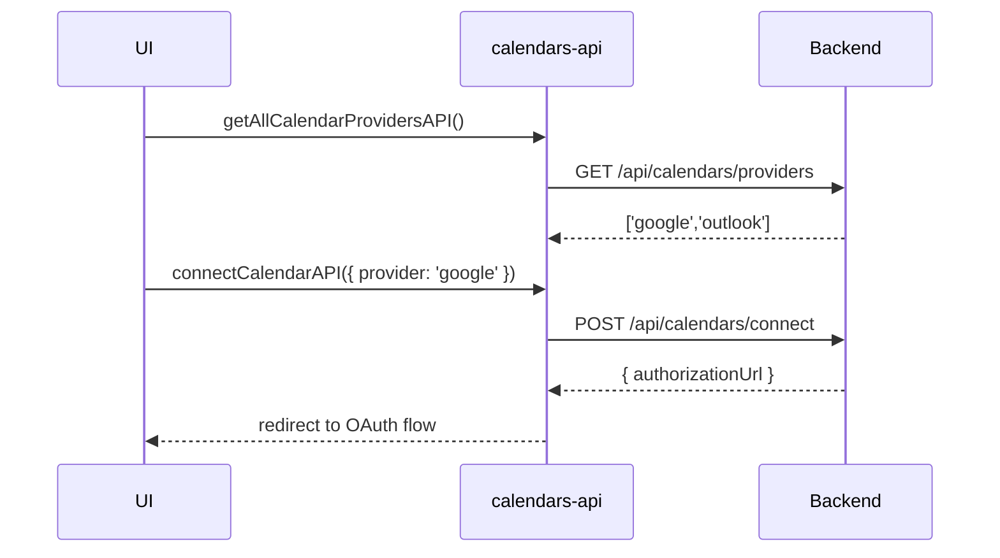

**File:** `src/api/services/calendars/calendars-api.ts`  
**Depends on:** `src/api/http-client.ts`

---

## Overview

The **Calendars API** integrates external calendar providers (Google, Outlook, etc.)  
It handles provider discovery and OAuth connection initiation.

| Function | Method & URL | Input | Output |
|---|---|---|---|
| `getAllCalendarProvidersAPI` | `GET api/calendars/providers` | — | `string[]` |
| `connectCalendarAPI` | `POST api/calendars/connect` | `ConnectInitRequest` | `ConnectInitResponse` |

---

## `getAllCalendarProvidersAPI() → Promise<string[]>`

Fetches all available calendar providers supported by the backend.

```ts
const response = await httpClient.get<string[]>('api/calendars/providers');
return response.data;
```

- Returns an array of provider identifiers (e.g. `["google", "microsoft", "apple"]`)
- Useful for dynamically listing connection options in UI.

## `connectCalendarAPI(payload: ConnectInitRequest) → Promise<ConnectInitResponse>`

Initiates a connection flow for a calendar provider.

```ts
const response = await httpClient.post<ConnectInitResponse>(
  '/api/calendars/connect',
  payload,
  { withCredentials: true },
);
return response.data;
```

- **Body**: `{ provider: string, redirectUrl: string }`
- **Returns**: a structured response containing authorization URL or connection metadata
- **withCredentials**: required to maintain session

## Types

| Model                 | Path                                       | Description                              |
| --------------------- | ------------------------------------------ | ---------------------------------------- |
| `ConnectInitRequest`  | `src/api/models/calendars/connect-init.ts` | Connection initiation parameters         |
| `ConnectInitResponse` | `src/api/models/calendars/connect-init.ts` | Server response (auth URL, status, etc.) |


## Example

```ts
import { getAllCalendarProvidersAPI, connectCalendarAPI } from '@/api/services/calendars/calendars-api';

const providers = await getAllCalendarProvidersAPI();
// → ['google', 'outlook']

const res = await connectCalendarAPI({ provider: 'google', redirectUrl: window.location.origin });
window.location.href = res.authorizationUrl; // redirect to OAuth consent
```

## Sequence



<br></br>
<br></br>
> Owner: @aleb, el Hijo del Diablo · Last reviewed: Tue, 21 Oct 2025