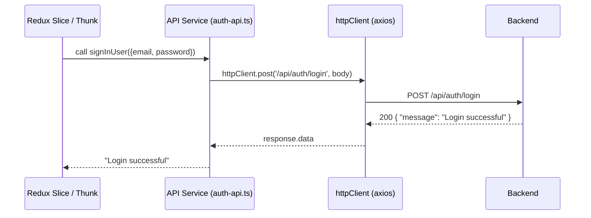

The **API Layer** is a thin abstraction over `axios` that:

- centralizes base URL, headers, credentials, and interceptors
- exposes service modules per domain (`auth`, `products`, `user`, …)
- returns typed data to **Redux thunks** and components

**Key files**
- `src/api/http-client.ts` — shared `axios` instance, interceptors, optional mocks
- `src/api/services/*` — domain-specific API functions (e.g., `auth-api.ts`)
- `src/api/models/*` — TypeScript models for requests/responses

### Call flow

  
  
  
> See slice docs for how thunks consume these functions.
  
  
> Owner: @aleb, el Hijo del Diablo · Last reviewed: Tue, 21 Oct 2025