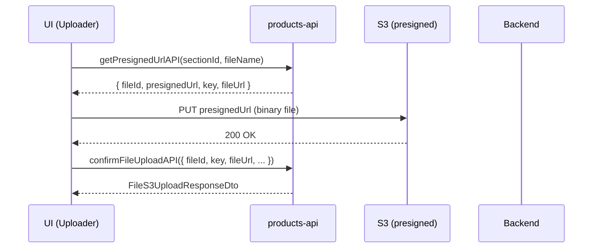

**File:** `src/api/services/products/products-api.ts`  
**Depends on:** `src/api/http-client.ts`  
**Used by:** `products` slice thunks (`createCourseProduct`, `updateCourseProductDetails`, `createSection`, `createLesson`, `getAllProductsByUserId`, `getProductByProductId`, etc.)

## Overview

This module wraps all product-related HTTP calls:
- **Products CRUD**
- **Course Sections & Lessons CRUD**
- **Queries & search (paged, sortable)**
- **Images & file uploads (incl. S3 presigned flow)**

All functions return `response.data` (already unwrapped from Axios), throw on error, and rely on the shared `httpClient` (Axios) instance with interceptors.

---

## Quick reference

| Area | Function | Method & URL | Input | Output |
|---|---|---|---|---|
| Products | `createProductAPI` | `POST api/products` | `AbstractProduct` | `AbstractProduct` |
|  | `updateProductDetailsAPI` | `PUT api/products` | `AbstractProduct` | `AbstractProduct` |
|  | `deleteProductAPI` | `DELETE api/products?userId=&productType=&id=` | `IRemoveProductPayload` | `string` |
|  | `getAllProductsByUserIdAPI` | `GET api/products?userId=` | `userId: string` | `AbstractProduct[]` |
|  | `getProductByProductIdAPI` | `GET api/products/getProduct?productId=&type=` | `{ productId, productType }` | `AbstractProduct` |
| Minimal | `getAllProductsMinimalAPI` | `GET api/products/get-all-products-min` | — | `ProductMinimised[]` |
|  | `getAllProductsMinimalByUserAPI` | `GET api/products/get-all-products-min?userId=` | `userId: string` | `ProductMinimised[]` |
| Search | `fetchProducts` | `GET /api/products/search?term=&page=&size=&sort=` | `{ term, page, size, sort? }` | `SearchResponse<ProductMinimised>` |
| Sections | `createSectionAPI` | `POST api/products/course/section` | `CourseSectionCreateRequest` | `CourseProductSection` |
|  | `updateSectionDetailsAPI` | `PUT api/products/course/section` | `CourseSectionUpdateRequest` | `string` |
|  | `deleteSectionAPI` | `DELETE api/products/course/section?userId=&id=` | `IRemoveItemPayload` | `string` |
| Lessons | `createLessonAPI` | `POST api/products/course/section/lesson` | `LessonCreate` | `CourseLesson` |
|  | `updateLessonDetailsAPI` | `PUT api/products/course/section/lesson` | `CourseLesson` | `string` |
|  | `deleteLessonAPI` | `DELETE api/products/course/section/lesson?userId=&id=` | `IRemoveItemPayload` | `string` |
| Images | `addImageToProductAPI` | `POST api/products/image?productId=` | `(file: File, productId: string)` | `string` |
| Files (S3) | `getPresignedUrlAPI` | `GET /api/files/presigned-url?sectionId=&folderType=DOWNLOAD_SECTION_FILES&filename=` | `(sectionId, fileName)` | `{ fileId, presignedUrl, key, fileUrl }` |
|  | `uploadToPresignedUrl` | `PUT presignedUrl` | `(presignedUrl, file)` | `Response` |
|  | `confirmFileUploadAPI` | `POST /api/files/confirm-upload` | `ConfirmUploadRequestDto` | `FileS3UploadResponseDto` |

---

## Function details

### Products

#### `createProductAPI(payload: AbstractProduct) → Promise<AbstractProduct>`
Creates a product (course / consultation / download).  
`POST api/products` with credentials; returns the created entity.

#### `updateProductDetailsAPI(payload: AbstractProduct) → Promise<AbstractProduct>`
Updates an existing product.  
`PUT api/products` with credentials; returns the updated entity.

#### `deleteProductAPI(payload: IRemoveProductPayload) → Promise<string>`
Deletes a product by `userId`, `productType`, and `id` (via query params).  
`DELETE api/products?userId=&productType=&id=`

#### `getAllProductsByUserIdAPI(userId: string) → Promise<AbstractProduct[]>`
Gets all products belonging to a user.  
`GET api/products?userId=...`

#### `getProductByProductIdAPI(productId: string, productType: ProductType) → Promise<AbstractProduct>`
Fetches one product by ID + type.  
`GET api/products/getProduct?productId=&type=`

---

### Minimal listings & search

#### `getAllProductsMinimalAPI() → Promise<ProductMinimised[]>`
Lightweight listing for cards/grids.  
`GET api/products/get-all-products-min`

#### `getAllProductsMinimalByUserAPI(userId: string) → Promise<ProductMinimised[]>`
User-specific minimal listing.  
`GET api/products/get-all-products-min?userId=...`

#### `fetchProducts({ term, page, size, sort? }) → Promise<SearchResponse<ProductMinimised>>`
Paged + sortable search endpoint.  
- Default sort: `createdAt,desc`  
- `sort` param shape: `{ field: keyof ProductMinimised, order: 'asc'|'desc' }` → `field,order`

---

### Course Sections

#### `createSectionAPI(payload: CourseSectionCreateRequest) → Promise<CourseProductSection>`
`POST api/products/course/section`

#### `updateSectionDetailsAPI(payload: CourseSectionUpdateRequest) → Promise<string>`
`PUT api/products/course/section`

#### `deleteSectionAPI(payload: IRemoveItemPayload) → Promise<string>`
`DELETE api/products/course/section?userId=&id=`

---

### Lessons

#### `createLessonAPI(payload: LessonCreate) → Promise<CourseLesson>`
`POST api/products/course/section/lesson`

#### `updateLessonDetailsAPI(payload: CourseLesson) → Promise<string>`
`PUT api/products/course/section/lesson`

#### `deleteLessonAPI(payload: IRemoveItemPayload) → Promise<string>`
`DELETE api/products/course/section/lesson?userId=&id=`

---

### Images & File uploads

#### `addImageToProductAPI(image: File, productId: string) → Promise<string>`
Uploads a product image via a simple `POST` (multipart not shown—backend expects `File` as body).  
`POST api/products/image?productId=...`

#### S3-style multi-step upload

1) **`getPresignedUrlAPI(sectionId, fileName)`**  
`GET /api/files/presigned-url?sectionId=&folderType=DOWNLOAD_SECTION_FILES&filename=`  
Returns `{ fileId, presignedUrl, key, fileUrl }`.

2) **`uploadToPresignedUrl(presignedUrl, file)`**  
Raw `fetch` `PUT` with `Content-Type` set to the file’s MIME. Returns `Response`.

3) **`confirmFileUploadAPI(payload: ConfirmUploadRequestDto)`**  
`POST /api/files/confirm-upload` with CSRF header (`X-XSRF-TOKEN` from cookie).  
Returns `FileS3UploadResponseDto`.

#### Sequence



## Types referenced

From your models/types (imported in this module):

- `AbstractProduct`, `ProductType` — `src/api/types/products.types`
- `ProductMinimised`, `IRemoveProductPayload`, `IRemoveItemPayload` — `src/api/models/product/product`
- `CourseProductSection`, `CourseSectionCreateRequest`, `CourseSectionUpdateRequest` — `src/api/models/product/section`
- `CourseLesson`, `LessonCreate` — `src/api/models/product/lesson`
- `ConfirmUploadRequestDto`, `FileS3UploadResponseDto` — `src/api/models/files/confirm-upload`

> Keep model files small and focused; reuse them in thunks and components for type safety.

## Usage examples

#### **In thunks (already wired in your slice)**

```ts
// Create a product and set it as current
dispatch(createCourseProduct(product))
  .unwrap()
  .then((p) => console.log('Created product', p));

// Create a section and push to current product
dispatch(createSection({ productId, title: 'Intro' }));
```

### Search in a component

```ts
import { fetchProducts } from '@/api/services/products/products-api';

const res = await fetchProducts({
  term: 'filmmaking',
  page: 0,
  size: 12,
  sort: { field: 'createdAt', order: 'desc' },
});
setResults(res.content);
```

### Presigned upload (simplified)

```ts
const { presignedUrl, key, fileId, fileUrl } = await getPresignedUrlAPI(sectionId, file.name);
await uploadToPresignedUrl(presignedUrl, file);
await confirmFileUploadAPI({ fileId, key, fileUrl, sectionId, size: file.size, contentType: file.type });
```

## Notes & conventions

- **Consistency**: Every function returns `response.data` (unwrapped) and `throws` errors; thunks use `extractErrorMessage` to normalize user-facing messages.
- **Credentials**: Most endpoints run with `withCredentials: true` via the shared client; query params are used for identifiers on deletes.
- **Sorting**: `fetchProducts` composes `sort=field,order` and defaults to `createdAt,desc`.