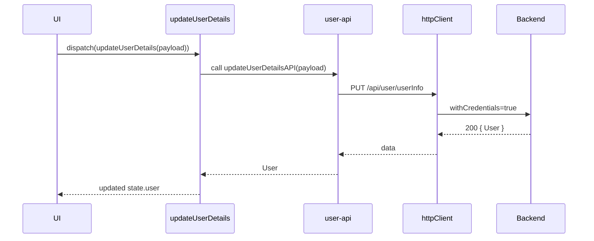

**File:** `src/api/services/user/user-api.ts`  
**Depends on:** `src/api/http-client.ts`  
**Used by:** `auth` slice (thunks: `getUserProfile`, `updateUserDetails`)

---

## Overview

The **User API** handles profile retrieval and updates.  
It uses the shared `httpClient` with CSRF and credentials support.

| Function | Method & URL | Input | Output |
|---|---|---|---|
| `getUserProfileAPI` | `GET api/user/userInfo` | — | `User` |
| `updateUserDetailsAPI` | `PUT api/user/userInfo` | `UpdateUserRequest` | `User` |

---

## `getUserProfileAPI() → Promise<User>`

Fetches the authenticated user’s profile.

```ts
const response = await httpClient.get<User>('api/user/userInfo', {
  headers: { 'X-CSRF-Force': true },
});
return response.data;
```

- **Headers**: `{ 'X-CSRF-Force': true }` ensures CSRF interceptor runs even for GETs.
- **Returns**: full `User` object with roles, onboarding state, etc.
- **Used by**: `auth/getUserProfile` thunk.


## `updateUserDetailsAPI(payload: UpdateUserRequest) → Promise<User>`

Updates profile info (name, bio, avatar, etc.).

```ts
const response = await httpClient.put<User>('api/user/userInfo', payload, {
  withCredentials: true,
});
return response.data;
```

- **Body**: `UpdateUserRequest`
- **Returns**: Updated `User`
- **Used by**: `auth/updateUserDetails` thunk.

## Types

| Model               | Path                                         | Description                                                |
| ------------------- | -------------------------------------------- | ---------------------------------------------------------- |
| `User`              | `src/api/models/user/user.ts`                | User profile object with id, name, roles, onboarding, etc. |
| `UpdateUserRequest` | `src/api/models/user/update-user-request.ts` | Fields allowed for update                                  |


## Example

```ts
import { updateUserDetailsAPI } from '@/api/services/user/user-api';

const updated = await updateUserDetailsAPI({
  displayName: 'The Debaucherous One',
  country: 'Spain',
});
console.log('Updated user', updated);
```

## Sequence




<br></br>
<br></br>
> Owner: @aleb, el Hijo del Diablo · Last reviewed: Tue, 21 Oct 2025