A high-level picture of the **frontend architecture** and its integration layers.

```mermaid
graph TD
  User["👤 User"] --> UI["💻 UI Components & Pages"]
  UI --> Router["🧭 React Router"]
  UI --> State["🧠 Redux Toolkit Store"]

  subgraph "Redux Store"
    State -->|auth actions| Auth["Auth Slice"]
    State -->|product CRUD| Products["Products Slice"]
    State -->|user prefs| Wishlist["Wishlist Slice"]
    State -->|checkout| ShopCart["ShopCart Slice"]
    State -->|UI alerts| Notifications["Notifications Slice"]
  end

  State --> Thunks["⚡ Async Thunks"]
  Thunks --> API["🌐 API Services (Axios)"]
  API --> Models["📦 Typed Models (TS Interfaces)"]
  API --> Swagger["🧾 Backend REST / Swagger API"]
  Swagger --> DB["🗄 Database"]

  subgraph "Persistence"
    Auth --> LocalStorage["🔐 localStorage / cookies"]
  end
```

### Layer breakdown
- **UI Layer:** Reusable `Gal*` components and route-based views.  
- **State Layer:** Redux Toolkit store combining multiple slices:
  - `auth`: manages login, profile, and roles  
  - `products`: CRUD for courses/consultations  
  - `shopCart` & `wishlist`: cross-linked user actions  
  - `notifications`: ephemeral UI messages
- **Side Effects:** All async logic uses `createAsyncThunk` (Axios-based APIs).
- **API Layer:** `/api/services/*` provides a clean separation between state and backend.  
- **Models:** `/api/models/*` defines typed entities shared by slices and components.  
- **Persistence:** Auth tokens and minimal cached data stored in `localStorage`.  
- **Backend:** Consumed via Swagger-documented REST API.

---

## Data Flow Example

> Owner: @aleb, el Hijo del Diablo · Last reviewed: 2025-10-20
