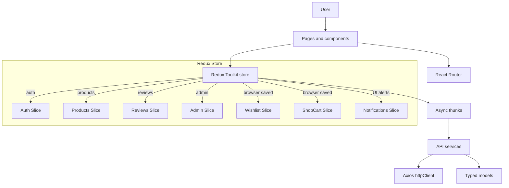
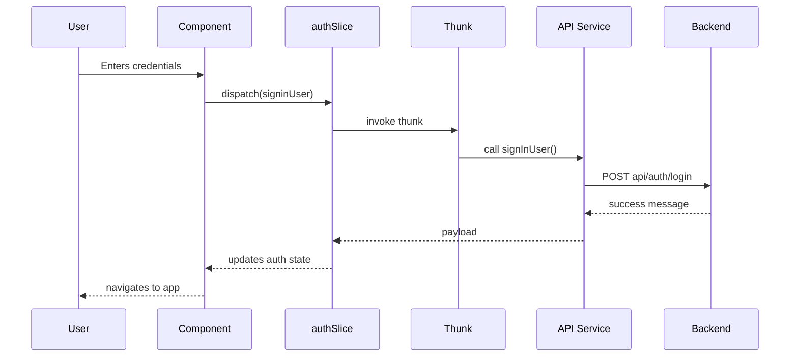

# Architecture Notes

## Overview

The Video Platform frontend is a React application organized around route-based pages, shared UI, Redux Toolkit state, and service wrappers under `src/core/api`.

## Layer breakdown

- **UI layer:** route pages under `src/domains`, shared UI under `src/shared`, and app-specific components under `src/domains/app/components`.
- **Routing layer:** React Router route trees for marketing, auth, and app areas.
- **State layer:** Redux Toolkit slices under `src/core/store`.
- **API layer:** service wrappers and typed models under `src/core/api`.
- **Browser persistence:** current wishlist and cart state are browser-saved.

## Data flow example

