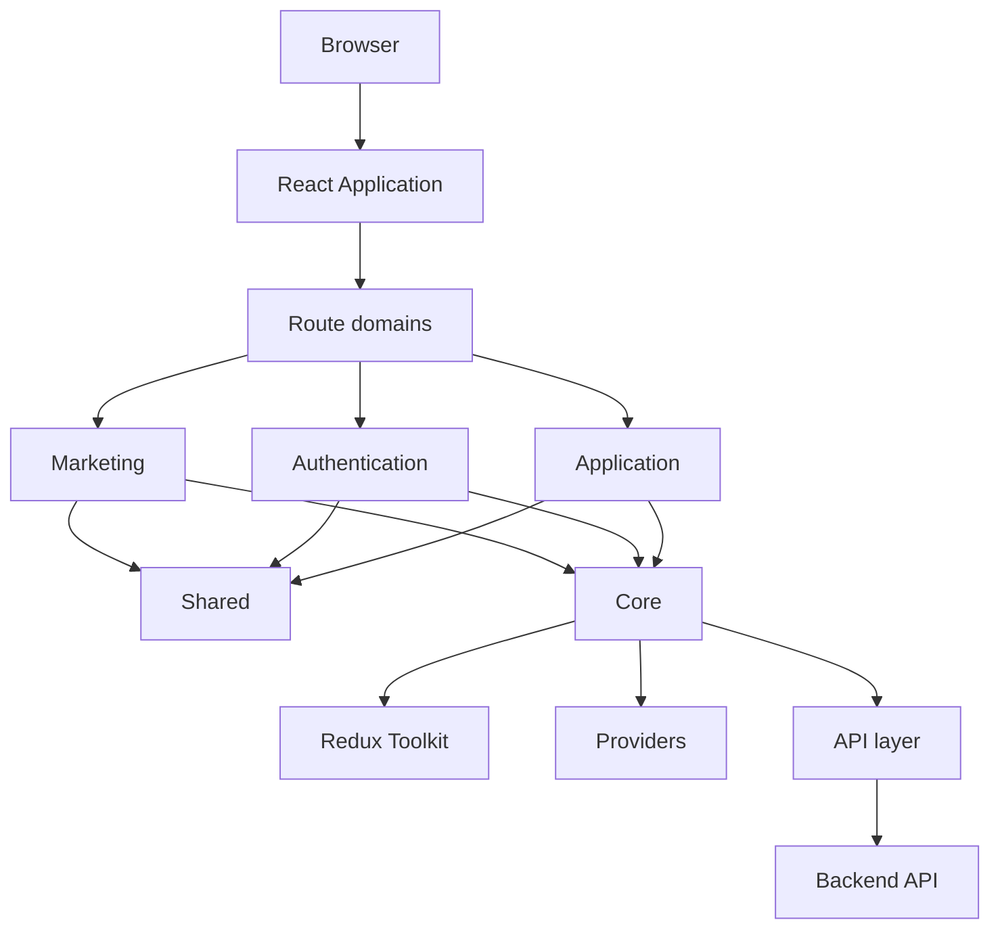

# Architecture Overview

This section explains how the frontend is organized today. It gives new developers a quick mental model before they use the detailed reference documentation.

The implementation repository, `video-platform-ui`, is the source of truth. These pages describe current code only, not planned architecture.

## High-level shape

`video-platform-ui` is a React single-page application organized around three route-facing domains:

- **Marketing**: public pages under `/`.
- **Auth**: sign-up, sign-in, verification, and password reset routes under `/auth`.
- **App**: product discovery, customer, creator, and admin experiences, mostly under `/app`.

Those areas sit on top of shared UI, centralized core infrastructure, and backend-facing API services.

## Major building blocks

| Area | Purpose |
|---|---|
| `src/domains` | Route-facing domains: marketing, auth, and app. |
| `src/core` | Shared infrastructure: API services, models, Redux store, providers, constants, and enums. |
| `src/shared` | Reusable UI, shared pages, hooks, icons, and utilities that are not owned by one domain. |
| `src/styles` | Global SCSS foundation such as variables, reset, spacing, typography, and mixins. |

The project is a practical hybrid. Domains own most route and page composition, while `core` owns shared state and backend integration. It is not a strict domain-driven or clean-architecture implementation.

## Architecture pages

- [Application Structure](./application-structure.md) explains where code lives and how the main folders interact.
- [Routing and Access](./routing-and-access.md) explains the routing strategy, layouts, protected routes, and role guards.
- [State and Data Flow](./state-and-data-flow.md) explains Redux Toolkit, service calls, React Query usage, local state, and persistence.

For exhaustive implementation details, use the existing references:

- [Routing and Access Reference](../routing-and-access-reference.md)
- [State Reference](../state-reference.md)
- [Frontend API Reference](../frontend-api-reference.md)
- [Component Catalog](../components/index.md)
