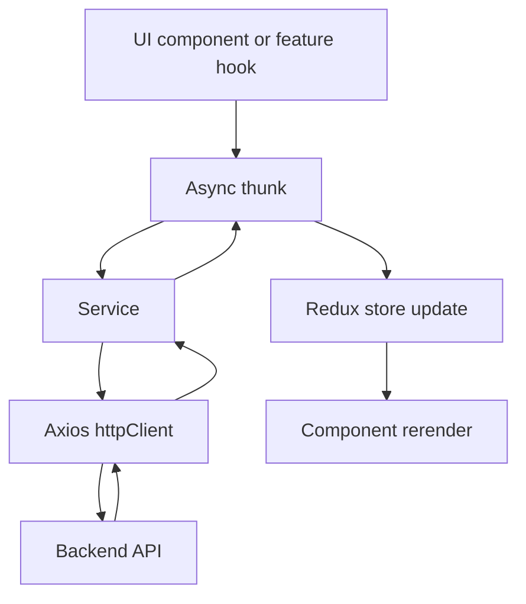
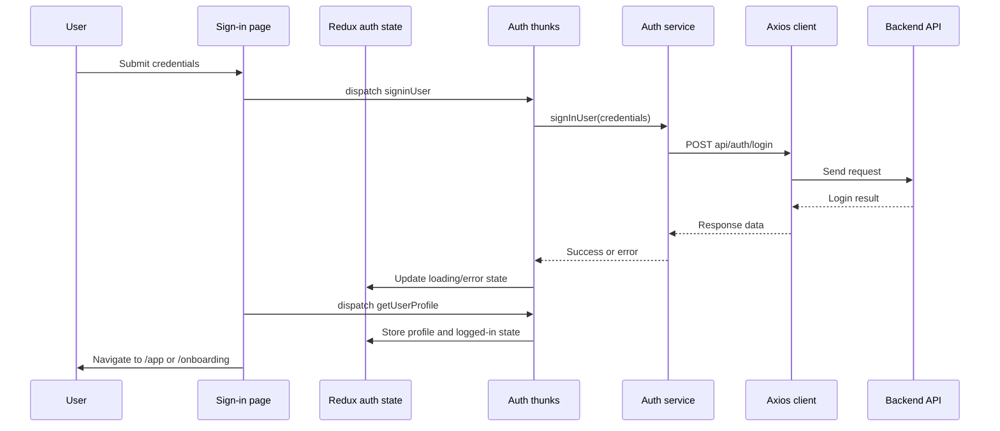

# State and Data Flow

The application uses Redux Toolkit as its main shared state layer. Backend calls are wrapped in services under `core/api/services`.

For slice-level details, see the [State Reference](../state-reference.md). For endpoint/service details, see the [Frontend API Reference](../frontend-api-reference.md).

## Main state patterns

| Pattern | Current use |
|---|---|
| Redux Toolkit store | Shared application state, including auth, products, admin data, reviews, notifications, cart, and wishlist. |
| Async thunks | Common pattern for backend-backed actions such as login, profile loading, product operations, and admin operations. |
| Services | API layer functions that call the shared Axios client and return response data. |
| React Query | Used narrowly for product search and autocomplete flows. It is provided globally but is not the default data layer everywhere. |
| Local component state | Used for form inputs, UI state, filters, tabs, dropdowns, and workflow-specific state. |
| Browser persistence | Used for cart and wishlist state. Auth persistence depends on backend/session behavior and profile loading. |

## Typical request flow

Most Redux-backed server interactions follow this architecture:

For React Query-backed search flows, the component calls a query function that uses the same product services and Axios client.

## Sign-in flow example

Sign-in follows the same pattern, with auth state and routing layered around the API call:

## Redux Toolkit

State is split into slices by broad concern, not by route. Examples include authentication, products, admin data, reviews, notifications, cart, and wishlist.

Slices commonly define:

- Local state shape.
- Reducers for client-side updates.
- Async thunks for backend calls.
- Extra reducers for pending, fulfilled, and rejected states.

Selectors live next to their slice folders where present.

## API services

Services live under `src/core/api/services`.

They are manually written wrappers around the shared Axios client. The client handles the base URL, credentials, CSRF handling, refresh-token handling, and optional local mocks.

This keeps most components and thunks from constructing raw HTTP requests.

## Local state and feature state

Not all state belongs in Redux.

Local UI state stays in components or feature hooks when it does not need to be shared globally. The product builder is the richest example: it uses feature hooks and a facade to coordinate form state, loading, autosave, sidebar navigation, and product actions before crossing into Redux and services.

Membership builder state is intentionally local to the product form page. `useMembershipBuilderState` owns native Membership content, included Product feed entries, ordering mode, and manual movement behavior. This lets Membership-specific state survive switching between builder tabs while the product form remains mounted, but it is not persisted across a full page refresh.

The Membership feed combines two separate concepts only for presentation: native Membership content and included standalone Products. `MembershipFeedEntry` provides the stable feed identity plus relationship metadata such as `addedAt` and optional ordering position/state. Membership-specific data currently remains outside Product DTOs, `ProductDraft`, Redux product state, and Product autosave payloads.

## Persistence and side effects

The cart and wishlist are browser-saved with `localStorage`.

Product-related success notifications are created through Redux listener middleware. Sonner is mounted globally for toast UI, but Redux notifications and Sonner usage are not the same system in the current implementation.

## Choosing where state belongs

Use this as a practical guide:

| State type | Usual location |
|---|---|
| Shared auth/session/user state | Redux auth slice. |
| Backend-backed product/admin/review state | Redux thunk + API service, unless the existing feature already uses React Query. |
| Search/autocomplete server state | Existing React Query pattern. |
| Form draft and UI interaction state | Local component or feature hook. |
| Reusable browser-saved cart/wishlist behavior | Existing Redux slices and persistence patterns. |
