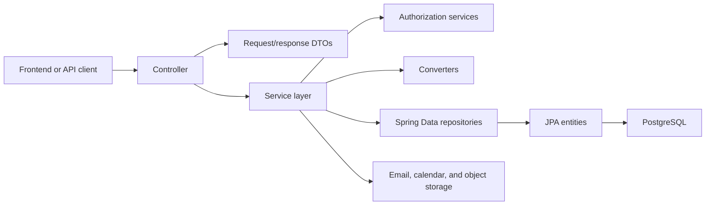

# Backend Architecture

## Application structure

The backend uses a layered Spring architecture under
`src/main/java/com/myproject/video/video_platform`.

| Package | Responsibility |
|---|---|
| `controller` | HTTP routes and transport-level handling |
| `controller/docs` | Springdoc operation descriptions implemented by controllers |
| `dto` | Request and response contracts |
| `service` | Business rules, authorization, transactions, and integrations |
| `entity` | JPA persistence models and relationships |
| `repository` | Spring Data repositories and specifications |
| `common/converter` | Entity/DTO mapping |
| `common/enums` | Persisted and API-visible domain values |
| `configs` | Security, OpenAPI, S3, and runtime configuration |
| `exception` | Domain exceptions and HTTP error mapping |

## Request flow

A typical request follows this sequence:

1. Spring Security evaluates URL-level authentication rules.
2. JWT authentication loads the principal from the access-token cookie.
3. The custom CSRF filter validates state-changing requests.
4. Method-level `@PreAuthorize` rules enforce roles where declared.
5. The controller maps HTTP input into a DTO and calls a service.
6. The service enforces ownership, domain rules, and transaction boundaries.
7. Repositories load or persist JPA entities.
8. Converters produce response DTOs.
9. `GlobalExceptionHandler` maps known failures to API error responses.

## Product strategy

The abstract `Product` entity uses JPA `TABLE_PER_CLASS` inheritance. There is
no shared `products` table; Course, Download, Consultation, and Membership each have a
concrete Product table containing the common columns.

`ProductService` dispatches type-specific behavior through
`ProductTypeHandler` implementations:

- `CourseProductHandler`
- `DownloadProductHandler`
- `ConsultationProductHandler`
- `MembershipProductHandler`

Adding a Product type requires more than adding an enum value. A complete type
needs DTOs, an entity/table, repository, converter, strategy handler,
authorization behavior, migration, tests, and OpenAPI updates.

## Cross-cutting services

| Service/configuration | Responsibility |
|---|---|
| `CurrentUserService` | Resolves the authenticated UUID from the JWT subject |
| `ProductAuthorizationService` | Owner-or-Admin checks and owner selection during creation |
| `ProductContentAccessService` | Entitlement checks and removal of protected Product content |
| `ProductEntitlementService` | Enrollment, library queries, grant/revoke primitives |
| `ProductFileAccessService` | Authorized, time-limited Download URLs |
| `AdminAuditService` | Records and queries Admin actions |
| `StorefrontService` | Creator configuration and public Storefront read models |
| `ProductLandingPageService` | Published-only public presentation and owner/Admin configuration |
| `CreatorDashboardService` | Fixed 30-day Creator reporting summary |
| `ProductPresentationCleanupService` | Removes presentation references before Product deletion |
| `SecurityConfig` | Security chain, CORS, public routes, and filter order |
| `OpenApiDefaultResponsesConfig` | Adds shared authentication responses to OpenAPI operations |

## Transactions

Transaction boundaries live mainly in services. Mutations that update related
entities, entitlement state, quizzes, roles, or calendar connections use
`@Transactional`. Read paths that traverse managed relationships commonly use
read-only transactions.

Do not move domain transactions into controllers. If a new operation changes
multiple records, define the consistency boundary in the service layer.

## Error handling

Known exceptions map to deliberate HTTP statuses through
`GlobalExceptionHandler`, including authentication, access denied, validation,
not found, unsupported Product operations, and payment-required errors.

The generic exception handler currently returns HTTP 400 and includes the
exception message. This is a known risk: unexpected server failures should be
distinguished from client errors and should not disclose internal detail.

## Related pages

- [Authentication and Security](./authentication-and-security.md)
- [Products and Authoring](./products-and-authoring.md)
- [Persistence and Data Model](./persistence-and-data-model.md)
- [Current Backend Coverage](./current-limitations.md)
