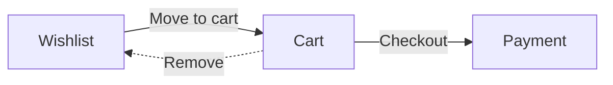

## Move item from Wishlist → Cart
1. Visit `/app/library/my-wishlist`
2. Click **Move to cart** on an item
3. On success: toast and item appears in `/app/cart`

Edge cases:
- Already in cart → show info toast
- Network error → retry button

  
  
> Owner: @aleb, el Hijo del Diablo · Last reviewed: Mon, 20 Oct 2025
